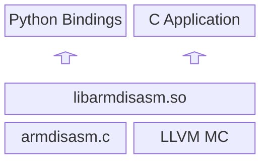

# Arm Disassembly Library

Arm Disassembly Library is a software library and API for decoding and disassembling AArch64 instructions.

The instruction decoder takes 32-bit instruction encodings as input and generates a data structure containing information about the decoded instruction, such as register usage and operand details.

The disassembly library API provides a way to produce text disassembly and query additional information about decoded instructions. The API aims to be as stable as possible.

The library source code is written in C/C++ and is built on the [LLVM project](https://github.com/llvm/llvm-project)'s MC (Machine Code) component. The API is available in C, C++, and Python. An installable Python package is built to provide the Python bindings.

The library has a small memory footprint and only temporarily allocates small amounts of memory in order to decode instructions. The library does not make system calls or perform I/O.

The library is designed to have minimal dependencies on the run-time environment, only requiring simple linking with common libraries such as libstdc++.

## Dependencies

The following packages and versions are required in order to build the library:
* CMake >= 3.20 (must be built from source if not available in OS' package repository)
* C++ compiler that supports C++11
* Python >= 3.7
* pip >= 21.0
* python3-build
* python3-setuptools >= 59.0
* virtualenv (installed using 'pip install')
* bc (basic calculator)

## Building

### Overview

Before using the Arm Disassembly Library, it must be built from source using the `build.sh` script provided.

Internally, the Arm Disassembly Library leverages the LLVM project. The library is built in two main stages:
* Build LLVM
* Build the Arm Disassembly Library (including example programs, tests, and Python bindings)

Firstly, the build script will first perform a shallow clone of LLVM and apply any required modifications/patches before building. Cloning and building LLVM is resource-heavy and requires ~5GB of disk space. This produces a static library build of LLVM with some minor changes that exposes methods within the MC component.

Secondly, libarmdisasm is created by combining the LLVM build and armdisasm code into a shared object library.
<!-- Original ascii drawing commented out.
```
 ___________________           __________________
|                   |         |                  |
|  Python bindings  |         |   C application  |
|___________________|         |__________________|
         / \                           / \
          |                             |
          |                             |
          |                             |
          |_____________________________|
            |                         |
            |     libarmdisasm        |
            |_________________________|
            |             |           |
            | armdisasm.c |  LLVM MC  |
            |_____________|___________|
```
--> 



Once built, the resulting shared object library `libarmdisasm` can be linked and used as a component in your own C/C++ applications. The Python package can be installed to provide bindings for your Python applications.

### Instructions

Follow the steps below to build the library. Before starting, ensure all dependencies above have been installed.

Clone this git repository:
```sh
git clone https://github.com/ArmDeveloperEcosystem/disassembly-library.git
```

Run the `build.sh` script from the project root directory to build the Arm Disassembly Library, examples, tests, and installable Python package.

To view script usage and options:
```sh
./build.sh --help
```

## Learning Path

For more information and examples on how to use this tool, check out the [Arm Learning Path](https://learn.arm.com/learning-paths/servers-and-cloud-computing/arm-disassembly-library).

## Compatibility

This library can be built for any platform, however it has only been tested on AArch64 Linux and x86-64 Linux. Currently, only AArch64 instructions are supported.

Please consider raising a [GitHub issue](https://github.com/ArmDeveloperEcosystem/disassembly-library/issues/new) if this tool does not work as expected on your system.

## Contributing

Contributions are welcome. In order to contribute, follow these steps:
* Read the [contribution agreement](CONTRIBUTING.md)
* Sign the commit message to indicate that you agree to the contribution agreement
# Submit a [pull request](https://github.com/ArmDeveloperEcosystem/disassembly-library/pulls) on GitHub

## Security

To report security vulnerabilities in this project, follow the guidance in the [security policy](SECURITY.md).

## License

This project is licensed under the [Apache-2.0 License](LICENSE).

The only exceptions to this are files stored under the `src/llvm-project/` subdirectory, which are licensed under the [Apache-2.0 License with LLVM Exceptions](src/llvm-project/LICENSE-Apache-2.0-with-LLVM-Exceptions).
